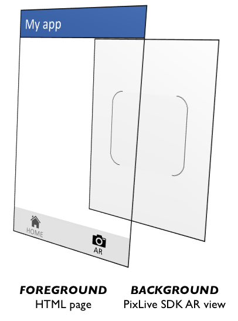

# Cordova plugin for PixLive SDK  [https://github.com/vidinoti/cordova-plugin-PixLive](https://github.com/vidinoti/cordova-plugin-PixLive)

This allows a seamless bridge for using Augmented Reality PixLive SDK into your own Cordova application.

Check [https://www.vidinoti.com/](https://www.vidinoti.com/) for more information and [https://vidinoti.github.io/](https://vidinoti.github.io/) for the complete documentation.

## 1. Installation
* Create a PixLive Maker account [http://pixlivemaker.com](http://pixlivemaker.com).
* Register you app, download SDKs and obtain a licence by following the steps described at [https://armanager.vidinoti.com/?page=appview](https://armanager.vidinoti.com/?page=appview).
* Install the plugin by passing the PixLive SDK `VDARSDK.framework`, `vdarsdk-release.aar` file paths and the license key to the plugin installation command line:

```bash
cordova plugin add cordova-plugin-pixlive@latest --variable LICENSE_KEY=MyLicenseKey --variable PIXLIVE_SDK_IOS_LOCATION=\"path/to/VDARSDK.framework\" --variable PIXLIVE_SDK_ANDROID_LOCATION=\"path/to/android/vdarsdk-release.aar\"
```


## 2. Create an augmented reality app in two minutes!
The best way to start developing your app is with a simple example. This demo app shows you the basis for using PixLive SDK in your cordova project.

* Create a new Cordova project using cordova-template-PixLive.

```bash
cordova create myArApp com.mycompany.myArApp myArApp --template git://github.com/vidinoti/cordova-template-PixLive.git
```

* Add Android and iOS platforms

```bash
cd myArApp
cordova platform add android
cordova platform add ios
```

* If not done already, create a Pixlive Maker account, register you app, download SDKs and obtain a licence by follwing the steps at [https://armanager.vidinoti.com/?page=appview](https://armanager.vidinoti.com/?page=appview). Add the Cordova plugin for PixLive SDK to your project by passing the PixLive SDK `VDARSDK.framework`, `vdarsdk-release.aar` file paths and the license key to the plugin installation command line:

```bash
cordova plugin add cordova-plugin-pixlive@latest --variable LICENSE_KEY=MyLicenseKey --variable PIXLIVE_SDK_IOS_LOCATION=\"path/to/VDARSDK.framework\" --variable PIXLIVE_SDK_ANDROID_LOCATION=\"path/to/android/vdarsdk-release.aar\"
```

* Build your project
```bash
cordova build android
cordova build ios
```

* Your demo app is ready, you can already test it!
```bash
cordova run android
```


## 3. The basis of building an AR app with PixLive SDK

* Content synchronization
To be able to trigger AR content you need to synchronize your app with your PixLive Maker account first.
```javascript
//Synchronize the app with PixLive Maker http://pixlivemaker.com
if (window.cordova && window.cordova.plugins && window.cordova.plugins.PixLive) {
    // You can pass an array of tags to synchronize with specific tags: synchronize(['test1','test2'])
    cordova.plugins.PixLive.synchronize([], synchSuccessListener, synchErrorListener);
}
```

* Create an ARview - The first time you open an ARview you need to create it.
```javascript
/**
 * Example of arView size
 * @return {number[]} [screenWidth,screenHeight]
 */
getArViewSize = function() {
    if(window.orientation == 90 || window.orientation == -90) {
        if(window.screen.height > window.screen.width) {
            return [window.screen.height, window.screen.width];
        }
    }
    return [window.screen.width, window.screen.height];
};
if (window.cordova && window.cordova.plugins && window.cordova.plugins.PixLive) {
	var arViewSize = getArViewSize();
	var arView = cordova.plugins.PixLive.createARView(0, 0, arViewSize[0], arViewSize[1]);
}
```

When the AR view is created, it is created behind the current application page (see illustration below). This allows the application to display content on top of the AR view.
However the area of the HTML page overlapping the AR view must be transparent (CSS: `background-color: transparent`) otherwise the AR view is not visible.
If you don't see the AR view, ensure that the DOM element (and it parents) hiding the AR view are all transparent.




* Handle the orientation changes
```javascript
/**
 * onOrientationchange Event listener
 */
onOrientationchange = function() {
	if(arView) {
	 var screenSize = getSize();
	 arView.resize(0, 0, screenSize[0], screenSize[1]);
	}
};
window.addEventListener("orientationchange", onOrientationchange, false);
```

* Close the arView
```javascript
if(arView) {
   arView.beforeLeave();
   arView.afterLeave();
}
```

* Reopen the arView
```javascript
if(arView) {
    arView.beforeEnter();
    onOrientationchange();
    arView.afterEnter();
}
```

* Handle PixLive events
```javascript
//event listeners for pixlive events
var pxlEventListeners={};
//Event handler for pixlive events
var pxlEventHandler = function(event) {
    if(event.type && pxlEventListeners[event.type]) {
        for(var i = pxlEventListeners[event.type].length-1; i>=0; i--) {
            pxlEventListeners[event.type][i](event);
        }
    }
};
/**
 * Add a new listener for the provided event type. 
 * @param {string} event The event to register for. 
 * @param {function} callback The function to be called when the provided event is generated.
 */
addListener = function(event, callback) {
	if(!pxlEventListeners[event]) {
	    pxlEventListeners[event]=[];
	}
	pxlEventListeners[event].push(callback);
}
//register pxlEventHandler
if (window.cordova && window.cordova.plugins && window.cordova.plugins.PixLive && !window.cordova.plugins.PixLive.onEventReceived) {
   cordova.plugins.PixLive.onEventReceived = pxlEventHandler;
}
```
PixLive events are: 

* `enterContext` - triggered when entering a context (image recognition, beacon detection, etc.)
* `exitContext` - triggered when exiting the context.
* `codeRecognize` - triggered when a QR code is recognized. It contains the content of the QR code.
* `presentAnnotations` - triggered when an AR content is displayed.
* `hideAnnotations` - triggered when the AR content is hidden.
* `requireSync` - triggered when a context asks for a new synchronization with some tags (See "Synchronization trigger" in PixLive Maker).
* `sensorTriggered` - triggered when a sensor has been triggered (image detection, beacon detection). The event is triggered even if the context does not contain any content.
* `sensorUpdate` - triggered when a sensor value is updated (e.g. beacon distance).
* `sensorUntriggered` - triggered when a sensor is untriggered.
* `eventFromContent` - triggered when a content sends an event to the application (e.g. if a coupon content is opened, the coupon id is sent via this callback).

For example:
```javascript
//enable PixLive SDK to catch the touch event when a content is displayed
addListener("presentAnnotations",function(event){
    arView.enableTouch();
});
//disable PixLive SDK to catch the touch event when a content is hidden
addListener("hideAnnotations",function(event){
    arView.disableTouch();
});
//take action when a QR code is recognized by the SDK
addListener("codeRecognize",function(event){
    alert("QR code recognized: " + event.code);
});
```

## How to contribute and create a new release

* Edit the plugin as needed
* Update the version number in `plugin.xml` and `package.json`
* Commit and push the changes to GitHub
* Create a new release from GitHub interface (releases > Draft a new release)

Publish a new release in npm registry:

* if necessary, `npm login`
* `npm publish`

## Release note

### Version 1.9.0 - 14 January 2019

requires PixLive SDK >= 6.5.5

* Android: add support for 64-bit architectures (arm64-v8a, x86_64)

### Version 1.8.2 - 15 August 2018

* Add default value fallback if variables PIXLIVE_SDK_ANDROID_LOCATION or PIXLIVE_SDK_IOS_LOCATION are missing when plugin is being installed

### Version 1.8.1 - 15 August 2018

* Add opengles-3 iOS Device capability requirement for SDK 6.5.0

### Version 1.8.0 - 25 June 2018

requires Vidinoti SDK >= 6.4.0

* Adapted for cordova-android 7.0.0
* Removed related code for Android push notifications, for adding support for Android push, install [cordova-plugin-vidinoti-push](https://github.com/vidinoti/cordova-plugin-vidinoti-push)

### Version 1.7.0 - 25 April 2018

requires PixLive SDK >= 6.3.0

* add new function for synchronizing with contexts (see `PixLive.synchronizeWithToursAndContexts`)

### Version 1.6.0 - 6 April 2018

requires PixLive SDK >= 6.2.0

* add new function for synchronizing with tours (see `PixLive.synchronizeWithTours`)
